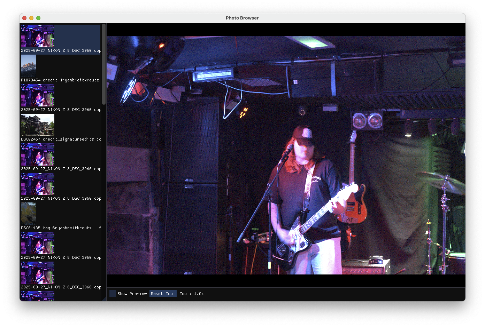

# Raw Photo Browser



A simple photo browser app built as an experiment using Claude Code.

## Building

```bash
brew install libraw sdl3
```

To Just Built It run

```bash
make release
```

To create an xcode project for debugging you also need to have `premake5` installed

```bash
brew install premake5
premake5 xcode4
open ./build/PhotoBrowser.xcworkspace
```

## Running

Launch the `photo-browser` executable, then drag a raw image of folder of raws onto the window.

You can also provide an image or folder path as an argument to the executable on the command line.
